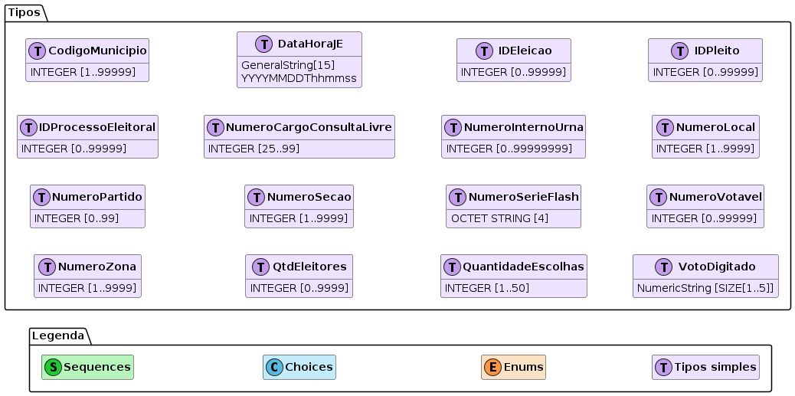
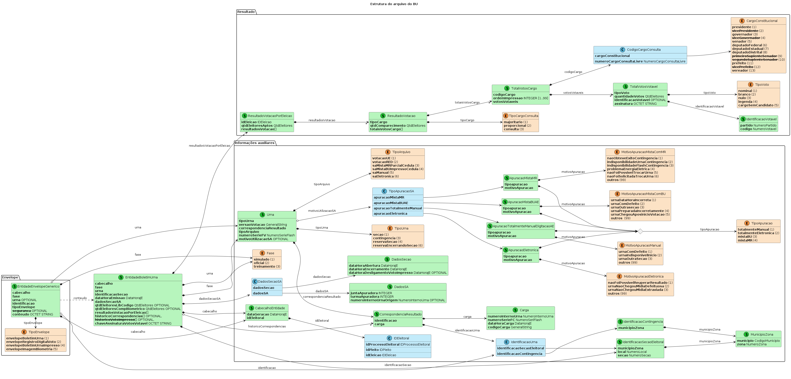
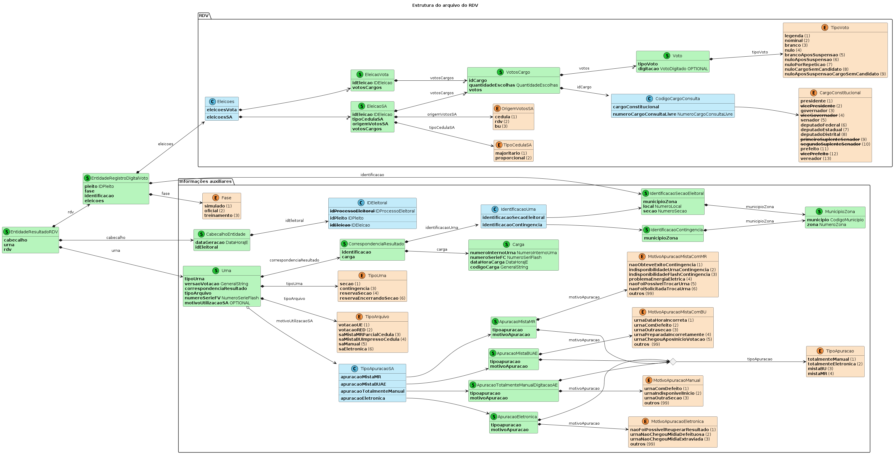
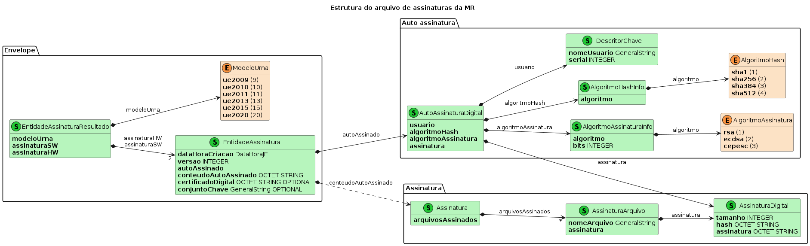

# Processamento dos arquivos de saída da urna eletrônica (UE)

- [Processamento dos arquivos de saída da urna eletrônica (UE)](#processamento-dos-arquivos-de-saída-da-urna-eletrônica-ue)
  - [Arquivos de saída da UE](#arquivos-de-saída-da-ue)
    - [Arquivos gerados pelo `VOTA`](#arquivos-gerados-pelo-vota)
    - [Arquivos gerados pelo `SA`](#arquivos-gerados-pelo-sa)
    - [Arquivos gerados pelo `RED`](#arquivos-gerados-pelo-red)
  - [Especificações do BU, do RDV e do arquivo de assinaturas](#especificações-do-bu-do-rdv-e-do-arquivo-de-assinaturas)
    - [Especificação do BU](#especificação-do-bu)
      - [Assinatura das tuplas do BU](#assinatura-das-tuplas-do-bu)
    - [Especificação do RDV](#especificação-do-rdv)
    - [Especificação do arquivo de assinaturas](#especificação-do-arquivo-de-assinaturas)
  - [Exemplos de leitores do BU, do RDV e do arquivo de assinatura](#exemplos-de-leitores-do-bu-do-rdv-e-do-arquivo-de-assinatura)
    - [Impressão do BU](#impressão-do-bu)
    - [Validação de assinatura das tuplas do BU](#validação-de-assinatura-das-tuplas-do-bu)
    - [Impressão do RDV](#impressão-do-rdv)
    - [Resumo do RDV](#resumo-do-rdv)
    - [Impressão do arquivo de assinaturas](#impressão-do-arquivo-de-assinaturas)
    - [Extração do certificado do arquivo de assinaturas](#extração-do-certificado-do-arquivo-de-assinaturas)
    - [Validação dos hashes dos arquivos da urna](#validação-dos-hashes-dos-arquivos-da-urna)

## Arquivos de saída da UE

Os resultados da votação são gravados em mídias de resultado&nbsp;(`MR`) para serem levadas aos
locais de transmissão onde serão lidas e seus conteúdos transferidos para o TSE para totalização e
demais procedimentos. Três sistemas da UE são capazes de gerar resultados totalizáveis:

- Software de votação&nbsp;(`VOTA`): sistema no qual os eleitores registram seus votos;
- Recuperador de dados&nbsp;(`RED`): sistema utilizado quando, por alguma pane, o `VOTA` não é capaz
  de gerar o resultado;
- Sistema de apuração&nbsp;(`SA`): sistema utilizado quando há votação em cédulas ou quando a `MR`
  não está legível ou acessível.

Os arquivos gerados pela UE seguem o seguinte padrão `fppppp-MMMMMZZZZSSSS.ext`, em que:

| componente | descrição                                                              |
| ---------- | ---------------------------------------------------------------------- |
| `f`        | é a fase&nbsp;(`s` para simulado e `o` para oficial)                   |
| `ppppp`    | é o código do pleito com zeros à esquerda                              |
| `MMMMM`    | é o código do município com zeros à esquerda                           |
| `ZZZZ`     | é o número da zona com zeros à esquerda                                |
| `SSSS`     | é o número da seção com zeros à esquerda                               |
| `ext`      | é a extensão que identifica o tipo do arquivo&nbsp;(ver tabela abaixo) |

Os diferentes tipos de arquivo gerados pela urna são mostrados na tabela abaixo, mostrando qual dos
sistemas da urna&nbsp;(`VOTA`, `RED`, e `SA`) os geram.

| Extensão  | Arquivo                                             |   VOTA   |   RED    |    SA    | Exemplo                        |
| --------- | --------------------------------------------------- | :------: | :------: | :------: | ------------------------------ |
| `bu`      | Boletim da Urna&nbsp;(BU)                           | &#10004; | &#10004; |          | `o01234-0567800230089.bu`      |
| `busa`    | Boletim da Urna&nbsp;(BU)                           |          |          | &#10004; | `o01234-0567800230089.busa`    |
| `chvtp`   | Chave de verificação de assinatura das tuplas do BU | &#10004; | &#10004; | &#10004; | `o01234-0567800230089.chvtp`   |
| `hash`    | Arquivo de hashes                                   | &#10004; | &#10004; | &#10004; | `o01234-0567800230089.hash`    |
| `imgbu`   | Imagem do BU Impresso                               | &#10004; | &#10004; |          | `o01234-0567800230089.imgbu`   |
| `imgbusa` | Imagem do BU Impresso                               |          |          | &#10004; | `o01234-0567800230089.imgbusa` |
| `jufa`    | Registro de comparecimento de eleitores e mesários  | &#10004; | &#10004; | &#10004; | `o01234-0567800230089.jufa`    |
| `logjez`  | Arquivo de LOG em formato texto                     | &#10004; | &#10004; |          | `o01234-0567800230089.log`     |
| `logsa`   | Arquivo de LOG em formato texto                     |          |          | &#10004; | `o01234-0567800230089.logsa`   |
| `rdv`     | Arquivo do Registro digital do Voto&nbsp;(RDV)      | &#10004; | &#10004; | &#10004; | `o01234-0567800230089.rdv`     |
| `rdvred`  | Arquivo do Registro digital do Voto&nbsp;(RDV)      |          | &#10004; |          | `o01234-0567800230089.rdvred`  |
| `ver`     | Arquivo de versões dos pacotes ASN.1                | &#10004; | &#10004; | &#10004; | `o01234-0567800230089.ver`     |
| `vscmr`   | Assinatura dos arquivos                             | &#10004; | &#10004; |          | `o01234-0567800230089.vscmr`   |
| `vscred`  | Assinatura dos arquivos                             |          | &#10004; |          | `o01234-0567800230089.vscred`  |
| `vscsa`   | Assinatura dos arquivos                             |          |          | &#10004; | `o01234-0567800230089.vscsa`   |
| `wsqbio`  | Digitais dos eleitores habilitados biometricamente  | &#10004; | &#10004; |          | `o01234-0567800230089.wsqbio`  |
| `wsqman`  | Digitais dos eleitores habilitados manualmente      | &#10004; | &#10004; |          | `o01234-0567800230089.wsqman`  |
| `wsqmes`  | Digitais dos mesários                               | &#10004; | &#10004; |          | `o01234-0567800230089.wsqmes`  |

Os nomes dos exemplos da tabela acima indicam que estes são os resultados oficiais&nbsp;(`o`), do
pleito de código&nbsp;`1234`, do município de código&nbsp;`5678`, da zona número&nbsp;`23` e da
seção de número&nbsp;`89`.

Cada sistema tem suas condições para gerar os diferentes arquivos.

### Arquivos gerados pelo `VOTA`

Os arquivos gerados pelo vota dependem da configuração da eleição e da disponibilidade de biometria
dos eleitores conforme a tabela abaixo.

| Extensão | Urna com biometria | Urna sem biometria |
| -------- | :----------------: | :----------------: |
| `bu`     |      &#10004;      |      &#10004;      |
| `chvtp`  |      &#10004;      |      &#10004;      |
| `hash`   |      &#10004;      |      &#10004;      |
| `imgbu`  |      &#10004;      |      &#10004;      |
| `jufa`   |      &#10004;      |      &#10004;      |
| `logjez` |      &#10004;      |      &#10004;      |
| `rdv`    |      &#10004;      |      &#10004;      |
| `ver`    |      &#10004;      |      &#10004;      |
| `vscmr`  |      &#10004;      |      &#10004;      |
| `wsqbio` |      &#10004;      |                    |
| `wsqman` |      &#10004;      |                    |
| `wsqmes` |      &#10004;      |                    |

### Arquivos gerados pelo `SA`

Os arquivos gerados pelo `SA` dependem do tipo de apuração realizada conforme a tabela abaixo.

| Extensão  | `MR` + cédulas | Demais tipos |
| --------- | :------------: | :----------: |
| `busa`    |    &#10004;    |   &#10004;   |
| `chvtp`   |    &#10004;    |   &#10004;   |
| `hash`    |    &#10004;    |   &#10004;   |
| `imgbusa` |    &#10004;    |   &#10004;   |
| `jufa`    |    &#10004;    |              |
| `logsa`   |    &#10004;    |   &#10004;   |
| `rdv`     |    &#10004;    |   &#10004;   |
| `ver`     |    &#10004;    |   &#10004;   |
| `vscsa`   |    &#10004;    |   &#10004;   |

### Arquivos gerados pelo `RED`

O `RED` pode recuperar os arquivos da UE e enviá-los para totalização ou para o `SA` para
complementá-los com eventuais cédulas de papel.

| Extensão | Para totalização | Para o `SA` |
| -------- | :--------------: | :---------: |
| `bu`     |     &#10004;     |             |
| `chvtp`  |     &#10004;     |             |
| `hash`   |     &#10004;     |             |
| `imgbu`  |     &#10004;     |  &#10004;   |
| `jufa`   |     &#10004;     |  &#10004;   |
| `logjez` |     &#10004;     |  &#10004;   |
| `rdv`    |     &#10004;     |             |
| `rdvred` |                  |  &#10004;   |
| `ver`    |     &#10004;     |             |
| `vscmr`  |     &#10004;     |             |
| `vscred` |                  |  &#10004;   |
| `wsqbio` |     &#10004;     |  &#10004;   |
| `wsqman` |     &#10004;     |  &#10004;   |
| `wsqmes` |     &#10004;     |  &#10004;   |

## Especificações do BU, do RDV e do arquivo de assinaturas

Os arquivos de saída da urna que são especificados em
ASN.1&nbsp;([Abstract Syntax Notation One](https://en.wikipedia.org/wiki/ASN.1)), como o BU e o RDV,
são codificados em
BER&nbsp;([Basic Encoding Rules](https://en.wikipedia.org/wiki/X.690#BER_encoding)).

Nos diagramas desta seção&nbsp;(ver legenda) as cores dos elementos significam:

- verde: `SEQUENCE`;
- azul: `CHOICE`;
- âmbar: `ENUMERATED`;
- lilás: tipos comuns.

Os tipos comuns foram omitidas dos diagramas principais&nbsp;(e são mostrados na legenda) para
evitar a poluição dos diagramas. Os membros que são desses tipos têm o nome do tipo especificado à
sua direita nos diagramas principais. Os tipos dos demais membros são obtidos das conexões.
Adicionalmente, os membros opcionais têm `OPTIONAL` escrito no próprio membro.



### Especificação do BU

Esta documentação se concentra da descrição do BU quando originados do `VOTA`&nbsp;(`.bu`), do
`RED`&nbsp;(`.bu`), ou do `SA`&nbsp;(`.busa`). A especificação ASN.1 do BU está disponível no
arquivo `spec/bu.asn1`.

A especificação ASN.1 do BU está representada esquematicamente no diagrama a seguir:



O campo `conteudo` de `EntidadeEnvelopeGenerico` é um `OCTET STRING`, e não do tipo
`EntidadeBoletimUrna`, uma vez que `EntidadeEnvelopeGenerico` é usado para envelopar diferentes
conteúdos. Portanto, a conexão, no diagrama, é representada com linha tracejada.

Os membros tachados, representam membros que não estão presentes e valores enumerados que não
ocorrem em BUs.

#### Assinatura das tuplas do BU

Como pode ser visto no diagrama acima, cada membro de `TotalVotosVotavel` possui uma `assinatura`
[Ed25519](https://en.wikipedia.org/wiki/EdDSA#Ed25519). O conteúdo assinado é o resumo
[SHA-512](https://en.wikipedia.org/wiki/SHA-2) da concatenação dos seguintes campos:

| *Campo*                             | *Votos nominais e de legenda* | *Votos nulos e brancos* |
| ----------------------------------- | :---------------------------: | :---------------------: |
| `TotalVotosCargo.codigoCargo`       |           &#10004;            |        &#10004;         |
| `TotalVotosVotavel.tipoVoto`        |           &#10004;            |        &#10004;         |
| `TotalVotosVotavel.quantidadeVotos` |           &#10004;            |        &#10004;         |
| `IdentificacaoVotavel.codigo`       |           &#10004;            |                         |
| `IdentificacaoVotavel.partido`      |           &#10004;            |                         |
| `Carga.codigoCarga`                 |           &#10004;            |        &#10004;         |

O arquivo `chvtp` contém a chave pública a ser utilizada para verificar a assinatura. A chave também
está disponível no membro `EntidadeBoletimUrna.chaveAssinaturaVotosVotavel`.

### Especificação do RDV

Esta documentação se concentra da descrição do RDV&nbsp;(`.rdv`). A especificação ASN.1 do RDV está
disponível no arquivo `spec/rdv.asn1`.

A especificação ASN.1 do RDV está representada esquematicamente no diagrama a seguir:



Os membros tachados, representam membros que não estão presentes, opções e valores enumerados que
não ocorrem em RDVs.

Como pode ser visto no diagrama acima, os votos dos eleitores são armazenados por eleição, por
cargo. Para salvaguardar seu sigilo, os votos dos eleitores são ordenados por `Voto.tipoVoto` e
`Voto.digitacao`. Dessa forma, primeiro aparacem os votos de legenda&nbsp;(somente para os cargos
proporcionais), depois os votos nominais, seguidos por votos brancos, e assim por diante&nbsp;(ver
os valores do enum `TipoVoto` no diagrama acima). Para cada um dos tipos de voto, os votos são
subordenados pela digitação registrada pelo eleitor. O script `rdv_resumo.py`&nbsp;(ver documentação
adiante) mostra a ordenação de forma clara

### Especificação do arquivo de assinaturas

O arquivo de assinaturas da MR (`.vscmr`) contém os hashes e assinatura digital dos arquivos de
resultado da urna eletrônica. A estrutura interna do arquivo de assinaturas é mostrada no diagrama
abaixo:



Há dois conjuntos de assinaturas no arquivo:

- `assinaturaSW` que contém os hashes e assinaturas efetuadas com as chaves de software e para o
  qual o campo `EntidadeAssinatura.certificadoDigital` é omitido;
- `assinaturaHW` que contém os hashes e assinaturas efetuadas com as chaves de hardware e para o
  qual o campo `EntidadeAssinatura.certificadoDigital` contém o certificado que permite a validação
  independente das assinaturas.

O campo `EntidadeAssinatura.autoAssinado` contém a assinatura do conteúdo do campo
`EntidadeAssinatura.conteudoAutoAssinado`, que é um `OCTET STRING`, que, por sua vez é o conteúdo
de Assinatura codificado em ASN.1 em BER com o hash e a assinatura de cada um dos arquivos.

## Exemplos de leitores do BU, do RDV e do arquivo de assinatura

Essa documentação é acompanhada por alguns scripts em Python 3 que realizam processamentos simples
nos arquivos do BU, do RDV e das assinaturas. Esses scripts podem servir como base para
desenvolvimento de ferramentas mais sofisticadas de processamento dos arquivos da urna.

Para utilizar os scripts fornecidos, é necessário instalar as bibliotecas:

- [`asn1tools`](https://pypi.org/project/asn1tools/);
- [`asn1crypto`](https://pypi.org/project/asn1crypto/);
- [`ed25519`](https://cryptobook.nakov.com/digital-signatures/eddsa-sign-verify-examples).

```bash
pip install asn1tools asn1crypto ed25519 ecdsa
git clone https://github.com/cslashm/ECPy.git && cd ECPy && pip install .
```

### Impressão do BU

Um script Python 3 que lê BU e imprime seu conteúdo decodificado no console está disponível no
arquivo `python/bu_dump.py`.

Para executar o script, use um comando semelhante a:

```bash
python <caminho para o script>/bu_dump.py \
    -a <caminho para a especificação>/bu.asn1 \
    -b <caminho para o arquivo de bu (.bu ou .busa)>
```

Para processar o BU com a biblioteca `asn1tools`, siga os passos:

1. crie um objeto informando o caminho para o arquivo de especificação do formato do
   BU&nbsp;(`bu.asn1`):

```python
conv = asn1tools.compile_files(asn1_path)
```

2. leia o conteúdo do arquivo de BU:

```python
with open(bu_path, "rb") as file:
    envelope_encoded = bytearray(file.read())
```

3. converta o conteúdo do envelope&nbsp;(essa operação cria um dicionário com a estrutura descrita
   no diagrama do BU):

```python
envelope_decoded = conv.decode("EntidadeEnvelopeGenerico", envelope_encoded)
```

4. o conteúdo do BU está no campo `"conteudo"` do dicionário. Converta esse conteúdo:

```python
bu_encoded = envelope_decoded["conteudo"]
bu_decoded = conv.decode("EntidadeBoletimUrna", bu_encoded)
```

5. A informação do BU está agora disponível na variável `bu_decoded` para ser processada. No exemplo
   fornecido, o conteúdo é impresso para o console.

### Validação de assinatura das tuplas do BU

O script Python 3 que lê BU e valida as assinaturas das tuplas do BU está disponível no arquivo
`python/bu_assinatura_tuplas.py`.

Para executar o script, use um comando semelhante a:

```bash
python <caminho para o script>/bu_assinatura_tuplas.py \
    -a <caminho para a especificação>/bu.asn1 \
    -b <caminho para o arquivo de bu (.bu ou .busa)>
```

Para verificar a assinatura das tuplas o BU com as bibliotecas `asn1tools` e `ed25519`, siga os
passos:

1. crie um objeto informando o caminho para o arquivo de especificação do formato do
   BU&nbsp;(`bu.asn1`). É importante passar o parâmetro `numeric_enums: True` para obter os valores
   numéricos de código do cargo e tipo do voto:

```python
conv = asn1tools.compile_files(asn1_paths, numeric_enums=True)
```

2. leia o conteúdo do arquivo de BU:

```python
with open(bu_path, "rb") as bu:
    envelope_encoded = bytearray(bu.read())
```

3. converta o conteúdo do envelope&nbsp;(essa operação cria um dicionário com a estrutura descrita
   no diagrama acima):

```python
envelope_decoded = conv.decode("EntidadeEnvelopeGenerico", envelope_encoded)
```

4. o conteúdo do BU está no campo `"conteudo"` do dicionário. Converta esse conteúdo:

```python
bu_encoded = envelope_decoded["conteudo"]
bu_decoded = conv.decode("EntidadeBoletimUrna", bu_encoded)
```

5. A informação do BU está agora disponível na variável `bu_decoded` para ser processada.
6. A chave para validar a assinatura é obtida no campo `chaveAssinaturaVotosVotavel` da estrutura
   `EntidadeBoletimUrna`&nbsp;(a chave também está disponível no arquivo `chvtp`):

```python
chave = bu_decoded["chaveAssinaturaVotosVotavel"]
```

7. Crie um objeto de verificação informando a chave lida:

```python
verificador = ed25519.VerifyingKey(chave)
```

8. Recupere o código da carga do campo `Carga.codigoCarga`;
9.  Navegue nas estruturas e obtenha as informações para compor o conteúdo a ser assinado;
10. Monte a string concatenando as informações para serem validadas:

```python
claro = f"{codigoCargo}{tipoVoto}{qtdVotos}{identificacao}{carga}".encode("iso8859=1")
```

11. Calcule o SHA-512 desse conteúdo:

```python
hashed = hashlib.sha512(claro).digest()
```

12. Recupere a assinatura do objeto do BU:

```python
assinatura = votosVotavel["assinatura"]
```

13. Verifique a assinatura:

```python
verificador.verify(assinatura, hashed)
```

### Impressão do RDV

Um script Python 3 que lê RDV e imprime seu conteúdo decodificado no console está disponível no
arquivo `python/rdv_dump.py`.

Para executar o script, use um comando semelhante a:

```bash
python <caminho para o script>/rdv_dump.py \
    -a <caminho para a especificação>/rdv.asn1 \
    -r <caminho para o arquivo de rdv (.rdv)>
```

Para processar o RDV com a biblioteca `asn1tools`, siga os passos:

1. crie um objeto informando o caminho para o arquivo de especificação do formato do
   RDV&nbsp;(`rdv.asn1`):

```python
conv = asn1tools.compile_files(asn1_path)
```

2. leia o conteúdo do arquivo de RDV:

```python
with open(rdv_path, "rb") as file:
    rdv_encoded = bytearray(file.read())
```

3. converta o conteúdo do envelope&nbsp;(essa operação cria um dicionário com a estrutura descrita
   no diagrama acima):

```python
rdv_decoded = conv.decode("EntidadeResultadoRDV", rdv_encoded)
```

4. A informação do RDV está agora disponível na variável `rdv_decoded` para ser processada. No
   exemplo fornecido, o conteúdo é impresso para o console.

### Resumo do RDV

Um script Python 3 que lê RDV e imprime um resumo dos votos registrados está no arquivo
`python/rdv_resumo.py`.

Para executar o script, use um comando semelhante a:

```bash
python <caminho para o script>/rdv_resumo.py \
    -r <caminho para o arquivo de rdv (.rdv)>
```

Esse script não utiliza a especificação ASN.1, porque ele tem a especificação codificada em classes.

### Impressão do arquivo de assinaturas

Um script Python 3 que lê o arquivo de assinaturas e imprime seu conteúdo decodificado no console
está disponível no arquivo `python/assinatura_dump.py`.

Para executar o script, use um comando semelhante a:

```bash
python <caminho para o script>/assinatura_dump.py \
    -a <caminho para a especificação>/assinatura.asn1 \
    -r <caminho para o arquivo de assinaturas (.vscmr)>
```

Para processar o arquivo de assinatura com a biblioteca `asn1tools`, siga os passos:

1. crie um objeto informando o caminho para o arquivo de especificação do formato do
   arquivo de assinaturas&nbsp;(`assinatura.asn1`):

```python
conv = asn1tools.compile_files(asn1_path)
```

2. leia o conteúdo do arquivo de assinaturas:

```python
with open(rdv_path, "rb") as file:
    envelope_encoded = bytearray(file.read())
```

3. converta o conteúdo do envelope&nbsp;(essa operação cria um dicionário com a estrutura descrita
   no diagrama acima):

```python
envelope_decoded = conv.decode("EntidadeAssinaturaResultado", envelope_encoded)
```

4. A informação do RDV está agora disponível na variável `envelope_decoded` para ser processada. No
   script de exemplo fornecido, o conteúdo é impresso para o console.

Como observado anteriormente, para processar o conteúdo do campo
`EntidadeAssinatura.conteudoAutoAssinado`, é necessário decodificá-lo:

```python
conteudo = entidade_assinatura["conteudoAutoAssinado"]
assinatura = conv.decode("Assinatura", conteudo)
```

### Extração do certificado do arquivo de assinaturas

Um script Python 3 que lê o arquivo de assinaturas e extrai o certificado para possibilitar a
validação das assinaturas está disponível no arquivo `python/assinatura_certificado.py`.

Para executar o script, use um comando semelhante a:

```bash
python <caminho para o script>/assinatura_certificado.py \
    -a <caminho para a especificação>/assinatura.asn1 \
    -r <caminho para o arquivo de assinaturas (.vscmr)> \
    -o <caminho para o arquivo de certificado sem extensão (arquivo de saída)>
```

Após ser executado, esse script gera um arquivo `.pem` se o modelo de urna for 2020,
ou um arquivo `.der`, para os outros modelos.

### Validação dos hashes dos arquivos da urna

Um script Python 3 que lê o arquivo de assinaturas e verifica os hashes dos arquivos da urna está
disponível no arquivo `python/assinatura_hash.py`.

Para executar o script, use um comando semelhante a:

```bash
python <caminho para o script>/assinatura_hash.py \
    -a <caminho para a especificação>/assinatura.asn1 \
    -r <caminho para o arquivo de assinaturas (.vscmr)>
```

Esse script pressupõe que os arquivos da urna estão no mesmo diretório que o arquivo de assinaturas.
