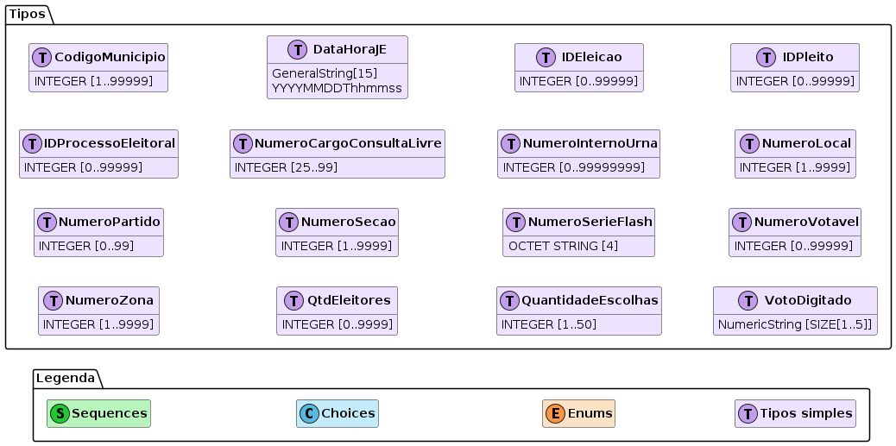
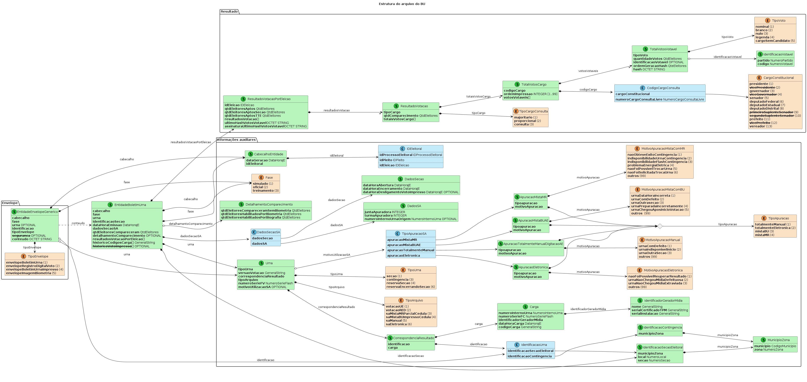
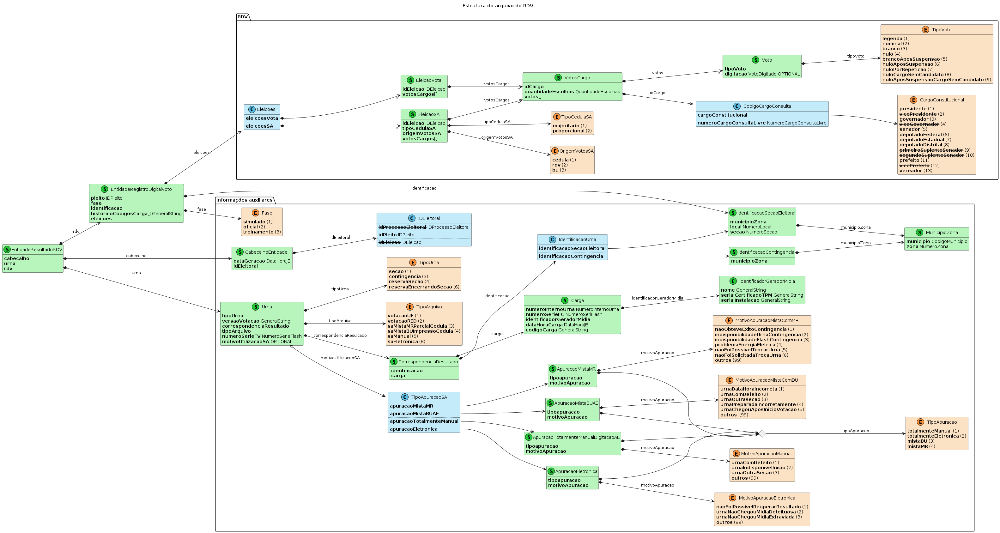
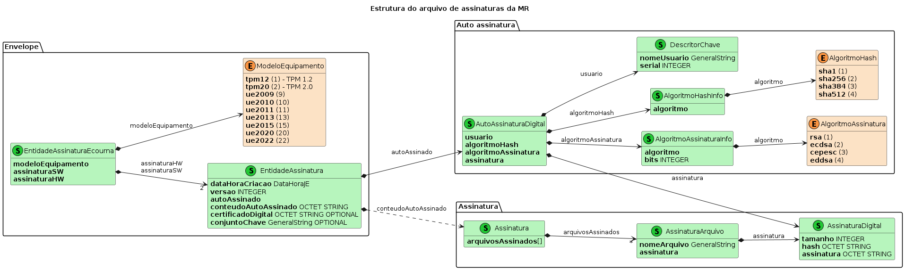

# Processamento dos arquivos de saída da urna eletrônica (UE)

- [Processamento dos arquivos de saída da urna eletrônica (UE)](#processamento-dos-arquivos-de-saída-da-urna-eletrônica-ue)
  - [Arquivos de saída da UE](#arquivos-de-saída-da-ue)
    - [Tipos de arquivos](#tipos-de-arquivos)
    - [Arquivos gerados pelo `VOTA`](#arquivos-gerados-pelo-vota)
    - [Arquivos gerados pelo `SA`](#arquivos-gerados-pelo-sa)
    - [Arquivos gerados pelo `RED`](#arquivos-gerados-pelo-red)
  - [Especificações do BU, do RDV e do arquivo de assinaturas](#especificações-do-bu-do-rdv-e-do-arquivo-de-assinaturas)
    - [Especificação do BU](#especificação-do-bu)
      - [Controle de integridade e autenticidade das tuplas do BU](#controle-de-integridade-e-autenticidade-das-tuplas-do-bu)
        - [Formação do hash](#formação-do-hash)
    - [Especificação do RDV](#especificação-do-rdv)
    - [Especificação do arquivo de assinaturas](#especificação-do-arquivo-de-assinaturas)
  - [Exemplos de leitores do BU, do RDV e do arquivo de assinatura](#exemplos-de-leitores-do-bu-do-rdv-e-do-arquivo-de-assinatura)
    - [Impressão do BU](#impressão-do-bu)
    - [Validação dos hashes das tuplas e da assinatura final das tuplas do BU](#validação-dos-hashes-das-tuplas-e-da-assinatura-final-das-tuplas-do-bu)
    - [Impressão do RDV](#impressão-do-rdv)
    - [Resumo do RDV](#resumo-do-rdv)
    - [Impressão do arquivo de assinaturas](#impressão-do-arquivo-de-assinaturas)
    - [Extração do certificado do arquivo de assinaturas](#extração-do-certificado-do-arquivo-de-assinaturas)
    - [Validação dos hashes e assinatura dos arquivos da urna](#validação-dos-hashes-e-assinatura-dos-arquivos-da-urna)

## Arquivos de saída da UE

Os resultados da votação são gravados em mídias de resultado&nbsp;(`MR`) para serem levadas aos
locais de transmissão onde serão lidas e seus conteúdos transferidos para o TSE para totalização e
demais procedimentos. Três sistemas da UE são capazes de gerar resultados totalizáveis:

- Software de votação&nbsp;(`VOTA`): sistema no qual os eleitores registram seus votos;
- Recuperador de dados&nbsp;(`RED`): sistema utilizado quando, por alguma pane, o `VOTA` não é capaz
  de gerar o resultado;
- Sistema de apuração&nbsp;(`SA`): sistema utilizado quando há votação em cédulas ou quando a `MR`
  não está legível ou acessível.

Os arquivos gerados pela UE seguem o seguinte padrão `fpppppuuMMMMMZZZZSSSS-suf.ext`, em que:

| componente | descrição                                                                                   |
| ---------- | ------------------------------------------------------------------------------------------- |
| `f`        | é a fase&nbsp;(`s` para simulado e `o` para oficial)                                        |
| `ppppp`    | é o código do pleito com zeros à esquerda                                                   |
| `uu`       | é a unidade da federação                                                                    |
| `MMMMM`    | é o código do município com zeros à esquerda                                                |
| `ZZZZ`     | é o número da zona com zeros à esquerda                                                     |
| `SSSS`     | é o número da seção com zeros à esquerda                                                    |
| `suf.ext`  | é o sufixo que identifica o conteúdo e o tipo do arquivo (para o domínio ver tabela abaixo) |

### Tipos de arquivos

Os diferentes tipos de arquivo gerados pela urna são listados na tabela abaixo, mostrando qual dos
sistemas da urna&nbsp;(`VOTA`, `RED`, e `SA`) os geram. Os tipos dos arquivos devem considerar o
sufixo mais a extensão, ou seja, a composição **suf.ext**, que será denominada deste ponto em diante
simplesmente de **extensão**.

Considere **ee** para a UF.

| Sufixo        | Arquivo                                            |   VOTA   |   RED    |    SA    | Exemplo                             |
| ------------- | -------------------------------------------------- | :------: | :------: | :------: | ----------------------------------- |
| `bu.dat`      | Boletim da Urna&nbsp;(BU)                          | &#10004; | &#10004; |          | `o11111ee2222233334444-bu.dat`      |
| `busa.dat`    | Boletim da Urna&nbsp;(BU)                          |          |          | &#10004; | `o11111ee2222233334444-busa.dat`    |
| `hash.dat`    | Arquivo de hashes                                  | &#10004; | &#10004; | &#10004; | `o11111ee2222233334444-hash.dat`    |
| `imgbu.dat`   | Imagem do BU Impresso                              | &#10004; | &#10004; |          | `o11111ee2222233334444-imgbu.dat`   |
| `imgbusa.dat` | Imagem do BU Impresso                              |          |          | &#10004; | `o11111ee2222233334444-imgbusa.dat` |
| `jufa.dat`    | Registro de comparecimento de eleitores e mesários | &#10004; | &#10004; | &#10004; | `o11111ee2222233334444-jufa.dat`    |
| `log.jez`     | Arquivo compactado de LOG em formato texto         | &#10004; | &#10004; |          | `o11111ee2222233334444-log.jez`     |
| `logsa.jez`   | Arquivo compactado de LOG em formato texto         |          |          | &#10004; | `o11111ee2222233334444-logsa.jez`   |
| `rdv.dat`     | Arquivo do Registro digital do Voto&nbsp;(RDV)     | &#10004; | &#10004; | &#10004; | `o11111ee2222233334444-rdv.dat`     |
| `rdvred.dat`  | Arquivo do Registro digital do Voto&nbsp;(RDV)     |          | &#10004; |          | `o11111ee2222233334444-rdvred.dat`  |
| `mr.ver`      | Arquivo de versões dos pacotes ASN.1               | &#10004; | &#10004; | &#10004; | `o11111ee2222233334444-mr.ver`      |
| `vota.vsc`    | Assinatura dos arquivos                            | &#10004; | &#10004; |          | `o11111ee2222233334444-vota.vsc`    |
| `red.vsc`     | Assinatura dos arquivos                            |          | &#10004; |          | `o11111ee2222233334444-red.vsc`     |
| `sa.vsc`      | Assinatura dos arquivos                            |          |          | &#10004; | `o11111ee2222233334444-sa.vsc`      |
| `wsqbio.jez`  | Digitais dos eleitores habilitados biometricamente | &#10004; | &#10004; |          | `o11111ee2222233334444-wsqbio.jez`  |
| `wsqman.jez`  | Digitais dos eleitores habilitados manualmente     | &#10004; | &#10004; |          | `o11111ee2222233334444-wsqman.jez`  |
| `wsqmes.jez`  | Digitais dos mesários                              | &#10004; | &#10004; |          | `o11111ee2222233334444-wsqmes.jez`  |

Os nomes dos exemplos da tabela acima indicam que estes são os resultados oficiais&nbsp;(`o`), do
pleito de código&nbsp;`11111`, do município de código&nbsp;`22222`, da zona número&nbsp;`3333` e da
seção de número&nbsp;`4444`.

Cada sistema tem suas condições para gerar os diferentes arquivos.

### Arquivos gerados pelo `VOTA`

Os arquivos gerados pelo vota dependem da configuração da eleição e da disponibilidade de biometria
dos eleitores conforme a tabela abaixo.

| Sufixo       | Urna com biometria | Urna sem biometria |
| ------------ | :----------------: | :----------------: |
| `bu.dat`     |      &#10004;      |      &#10004;      |
| `hash.dat`   |      &#10004;      |      &#10004;      |
| `imgbu.dat`  |      &#10004;      |      &#10004;      |
| `jufa.dat`   |      &#10004;      |      &#10004;      |
| `log.jez`    |      &#10004;      |      &#10004;      |
| `rdv.dat`    |      &#10004;      |      &#10004;      |
| `mr.ver`     |      &#10004;      |      &#10004;      |
| `vota.vsc`   |      &#10004;      |      &#10004;      |
| `wsqbio.jez` |      &#10004;      |                    |
| `wsqman.jez` |      &#10004;      |                    |
| `wsqmes.jez` |      &#10004;      |                    |

### Arquivos gerados pelo `SA`

Os arquivos gerados pelo `SA` dependem do tipo de apuração realizada conforme a tabela abaixo.

| Sufixo        | `MR` + cédulas | Demais tipos |
| ------------- | :------------: | :----------: |
| `busa.dat`    |    &#10004;    |   &#10004;   |
| `hash.dat`    |    &#10004;    |   &#10004;   |
| `imgbusa.dat` |    &#10004;    |   &#10004;   |
| `jufa.dat`    |    &#10004;    |              |
| `logsa.jez`   |    &#10004;    |   &#10004;   |
| `rdv.dat`     |    &#10004;    |   &#10004;   |
| `mr.ver`      |    &#10004;    |   &#10004;   |
| `sa.vsc`      |    &#10004;    |   &#10004;   |

### Arquivos gerados pelo `RED`

O `RED` pode recuperar os arquivos da UE e enviá-los para totalização ou para o `SA` para
complementá-los com eventuais cédulas de papel.

| Sufixo       | Para totalização | Para o `SA` |
| ------------ | :--------------: | :---------: |
| `bu.dat`     |     &#10004;     |             |
| `hash.dat`   |     &#10004;     |             |
| `imgbu.dat`  |     &#10004;     |  &#10004;   |
| `jufa.dat`   |     &#10004;     |  &#10004;   |
| `log.jez`    |     &#10004;     |  &#10004;   |
| `rdv.dat`    |     &#10004;     |             |
| `rdvred.dat` |                  |  &#10004;   |
| `mr.ver`     |     &#10004;     |             |
| `vota.vsc`   |     &#10004;     |             |
| `red.vsc`    |                  |  &#10004;   |
| `wsqbio.jez` |     &#10004;     |  &#10004;   |
| `wsqman.jez` |     &#10004;     |  &#10004;   |
| `wsqmes.jez` |     &#10004;     |  &#10004;   |

## Especificações do BU, do RDV e do arquivo de assinaturas

Os arquivos de saída da urna que são especificados em
ASN.1&nbsp;([Abstract Syntax Notation One](https://en.wikipedia.org/wiki/ASN.1)), como o BU e o RDV,
são codificados em
BER&nbsp;([Basic Encoding Rules](https://en.wikipedia.org/wiki/X.690#BER_encoding)).

Nos diagramas desta seção&nbsp;(ver legenda) as cores dos elementos significam:

- <font color="#21c834">**verde**</font>: `SEQUENCE`;
- <font color="#59b9de">**azul**</font>: `CHOICE`;
- <font color="#fa9441">**âmbar**</font>: `ENUMERATED`;
- <font color="#c39deb">**lilás**</font>: tipos comuns.

Os tipos comuns foram omitidos dos diagramas principais&nbsp;(e são mostrados na legenda) para
evitar a poluição dos diagramas. Os membros que são desses tipos têm o nome do tipo especificado à
sua direita nos diagramas principais. Os tipos dos demais membros são obtidos das conexões.
Adicionalmente, os membros opcionais têm `OPTIONAL` escrito no próprio membro e, caso o campo
referencie outro objeto, a conexão é representada com um diamante vazado.



### Especificação do BU

Este item se concentra da descrição do BU quando originados do `VOTA`&nbsp; e do `RED`&nbsp;
(`*bu.dat`), ou do `SA`&nbsp;(`*busa.dat`). A especificação ASN.1 do BU está disponível no arquivo
`spec/boletimurna.asn1`.

A especificação ASN.1 do BU está representada esquematicamente no diagrama a seguir:



O campo `conteudo` de `EntidadeEnvelopeGenerico` é um `OCTET STRING`, e não do tipo
`EntidadeBoletimUrna`, uma vez que `EntidadeEnvelopeGenerico` é usado para envelopar diferentes
conteúdos. Portanto, a conexão, no diagrama, é representada com linha tracejada.

Os membros tachados representam itens da especificação que não estão presentes e valores enumerados
que não ocorrem em BUs.

#### Controle de integridade e autenticidade das tuplas do BU

Como pode ser visto no diagrama acima, cada elemento de `TotalVotosVotavel` possui um `hash`. A
composição desse campo sempre faz referência a todo o conteúdo do elemento anterior. Dessa forma, o
hash do último elemento será formado a partir de todo o conjunto das tuplas do BU. Esse último
elemento é então assinado e disponibilizado junto com a respectiva assinatura em
`ResultadoVotacaoPorEleicao`.

##### Formação do hash

Como pode ser visto no diagrama da estrutura do arquivo de BU, o hash final
(`ultimoHashVotosVotavel`) e sua assinatura (`assinaturaUltimoHashVotosVotavel`) são armazenados na
estrutura `ResultadoVotacaoPorEleicao`. O cálculo do hash de cada elemento da sequência
`resultadosVotacaoPorEleicao`, calculando o hash inicial da string formada pela seguinte
concatenação:

```text
<idPleito:5>|<idEleicao:5>|<municipio:5>|<zona:4>|<secao:4>|<codigoCarga:24>
```

A partir desse primeiro hash, são calculados os hashes de cada um dos blocos de `TotalVotosVotavel`
a partir da concatenação dos seguintes campos:

```text
<hash anterior>|<ordemGeracaoHash>|<codigoCargo>|<tipoVoto>|<quantidadeVotos>|<identificacaoVotavel.codigo>|<identificacaoVotavel.partido>
```

Para o primeiro bloco do resultado da eleição, o hash anterior é o hash do cabeçalho. Para o
primeiro bloco de cada `totaisVotosCargo`, o valor de `ordemGeracaoHash` será 1. Para os demais, o
valor de `ordemGeracaoHash` é incrementado de 1 em 1. Ou seja, o hash inicial é calculado para cada
eleição e a `ordemGeracaoHash` é reiniciada para cada cargo.

```text
<hash anterior>|<ordemGeracaoHash anterior + 1>|<codigoCargo>|<tipoVoto>|<quantidadeVotos>|<identificacaoVotavel.codigo>|<identificacaoVotavel.partido>
```

No caso de votos nulos e brancos, os campos `identificacaoVotavel.codigo` e
`identificacaoVotavel.partido` são suprimidos.

Exemplo:

```text
[C04...61B]|2|13|1|50|66013|66
```

|                                    *Valores*                                    | *Campo*                         |
| :-----------------------------------------------------------------------------: | :------------------------------ |
| **`[C04...61B]`**, sha512 - hash anterior em string com hexadecimais maiúsculos | `hash do bloco`                 |
|                                       `2`                                       | `ordemGeracaoHash anterior + 1` |
|                                 `13` (Vereador)                                 | `codigoCargo`                   |
|                                  `1` (Nominal)                                  | `tipoVoto`                      |
|                                      `50`                                       | `quantidadeVotos`               |
|                                     `66013`                                     | `identificacaoVotavel.codigo`   |
|                                      `66`                                       | `identificacaoVotavel.partido`  |

Os blocos seguem a ordem indicada pelos campos `TotalVotosCargo.ordemImpressao` e
`TotalVotosVotavel.ordemGeracaoHash`, que representam exatamente a ordem em que os totais aparecem
no BU impresso.

### Especificação do RDV

Esta documentação se concentra da descrição do RDV&nbsp;(`rdv.dat`). A especificação ASN.1 do RDV
está disponível no arquivo `spec/rdv.asn1`.

A especificação ASN.1 do RDV está representada esquematicamente no diagrama a seguir:



Os membros tachados, representam membros que não estão presentes, opções e valores enumerados que
não ocorrem em RDVs.

Como pode ser visto no diagrama acima, os votos dos eleitores são armazenados por eleição, por
cargo. Para salvaguardar seu sigilo, os votos dos eleitores são ordenados por `Voto.tipoVoto` e
`Voto.digitacao`. Essa ordenação só é necessária no RDV do VOTA e do RED, no RDV do SA, ela não é
necessária. Dessa forma, primeiro aparecem os votos de legenda&nbsp;(somente para os cargos
proporcionais), depois os votos nominais, seguidos por votos brancos, e assim por diante&nbsp;(ver
os valores do enum `TipoVoto` no diagrama acima). Para cada um dos tipos de voto, os votos são
subordenados pela digitação registrada pelo eleitor. O script `rdv_resumo.py`&nbsp;(ver documentação
adiante) mostra a ordenação de forma clara.

### Especificação do arquivo de assinaturas

O arquivo de assinaturas da MR (`.vsc`) contém os hashes e assinatura digital dos arquivos de
resultado da urna eletrônica. A estrutura interna do arquivo de assinaturas é mostrada no diagrama
abaixo:



Há dois conjuntos de assinaturas no arquivo:

- `assinaturaSW` que contém os hashes e assinaturas efetuadas com as chaves de software e para o
  qual o campo `EntidadeAssinatura.certificadoDigital` é omitido;
- `assinaturaHW` que contém os hashes e assinaturas efetuadas com as chaves de hardware e para o
  qual o campo `EntidadeAssinatura.certificadoDigital` contém o certificado que permite a validação
  independente das assinaturas dos arquivos e das tuplas do BU.

O campo `EntidadeAssinatura.autoAssinado` contém a assinatura do conteúdo do campo
`EntidadeAssinatura.conteudoAutoAssinado`, que é um `OCTET STRING`, que, por sua vez é o conteúdo
de Assinatura codificado em ASN.1 em BER com o hash e a assinatura de cada um dos arquivos.

## Exemplos de leitores do BU, do RDV e do arquivo de assinatura

Essa documentação é acompanhada por alguns scripts em Python 3 que realizam processamentos simples
nos arquivos do BU, do RDV e das assinaturas. Esses scripts podem servir como base para
desenvolvimento de ferramentas mais sofisticadas de processamento dos arquivos da urna.

Para utilizar os scripts fornecidos, é necessário instalar as bibliotecas:

- [`asn1tools`](https://pypi.org/project/asn1tools/);
- [`pyOpenSSL`](https://www.pyopenssl.org/en/latest/index.html);
- [`ECPy`](https://github.com/cslashm/ECPy) - é necessário clonar o repositório e instalar a
  biblioteca a partir dos fontes, porque não há release do `ECPy` com a curva `Ed521`.

```bash
pip install asn1tools pyopenssl
git clone https://github.com/cslashm/ECPy.git && cd ECPy && pip install .
```

Todos os scripts possuem as opções `--help`, para imprimir o seu uso, e `--debug`, para que a saída
seja mais detalhada.

### Impressão do BU

Um script Python 3 que lê o BU e imprime seu conteúdo decodificado no console está disponível no
arquivo `python/bu_dump.py`.

Para executar o script, use um comando semelhante a:

```text
python3 <caminho para o script>/bu_dump.py \
    -a <caminho para a especificação>/bu.asn1 \
    -b <caminho para o arquivo de bu (*bu.dat ou *busa.dat)>
```

Para processar o BU com a biblioteca `asn1tools`, siga os passos:

1. crie um objeto informando o caminho para o arquivo de especificação do formato do
   BU&nbsp;(`bu.asn1`):

```python
conv = asn1tools.compile_files([asn1_path], codec="ber")
```

2. leia o conteúdo do arquivo de BU:

```python
with open(bu_path, "rb") as file:
    envelope_encoded = bytearray(file.read())
```

3. converta o conteúdo do envelope&nbsp;(essa operação cria um dicionário com a estrutura descrita
   no diagrama do BU):

```python
envelope_decoded = conv.decode("EntidadeEnvelopeGenerico", envelope_encoded)
```

4. o conteúdo do BU está no campo `"conteudo"` do dicionário. Converta esse conteúdo:

```python
bu_encoded = envelope_decoded["conteudo"]
bu_decoded = conv.decode("EntidadeBoletimUrna", bu_encoded)
```

5. A informação do BU está agora disponível na variável `bu_decoded` para ser processada. No exemplo
   fornecido, o conteúdo é impresso para o console.

### Validação dos hashes das tuplas e da assinatura final das tuplas do BU

O script Python 3 que lê o BU e valida os hashes das tuplas e a assinatura final das tuplas está
disponível no arquivo `python/bu_assinatura_tuplas.py`.

Para executar o script, use um comando semelhante a:

```text
python3 <caminho para o script>/bu_assinatura_tuplas.py \
    -a <caminho para a especificação asn1 do BU>/bu.asn1 \
    -b <caminho para o arquivo de bu (*bu.dat ou *busa.dat)> \
    -t <caminho para a especificação asn1 do arquivo de assinaturas>/assinatura.asn1 \
    -s <caminho para o arquivo de assinaturas (.vsc)>
```

Para ler a chave de validação das assinaturas das tuplas do BU, siga os passos:

1. crie um objeto informando o caminho para o arquivo de especificação do formato do
   arquivo de assinaturas&nbsp;(`assinatura.asn1`):

```python
conv = asn1tools.compile_files([asn1_path], codec="ber", numeric_enums=True)
```

2. leia o conteúdo do arquivo de assinaturas:

```python
with open(assinatura_path, "rb") as file:
    envelope_encoded = bytearray(file.read())
```

3. converta o conteúdo do envelope&nbsp;(essa operação cria um dicionário com a estrutura descrita
   no diagrama acima):

```python
ent_assinatura = conv.decode("EntidadeAssinaturaEcourna", envelope_encoded)
```

4. O certificado com a chave pública para validação das assinaturas das tuplas do BU está no campo
   `assinaturaHW.certificadoDigital`. Para as urnas modelo 2020 e 2022, o certificado esta em
   formato PEM e a chave é EDDSA com curva E521, para os demais modelos, o certificado está em
   formato ASN.1 e a chave é ECDSA.

O script de exemplo apenas imprime as chaves.

Para verificar os hashes das tuplas o BU, siga os passos:

1. crie um objeto informando o caminho para o arquivo de especificação do formato do
   BU&nbsp;(`bu.asn1`). É importante passar o parâmetro `numeric_enums: True` para obter os valores
   numéricos de código do cargo e tipo do voto:

```python
conv = asn1tools.compile_files([bu_asn1_path], codec="ber", numeric_enums=True)
```

2. leia o conteúdo do arquivo de BU:

```python
with open(bu_path, "rb") as bu:
    envelope_encoded = bytearray(bu.read())
```

3. converta o conteúdo do envelope&nbsp;(essa operação cria um dicionário com a estrutura descrita
   no diagrama acima):

```python
envelope_decoded = conv.decode("EntidadeEnvelopeGenerico", envelope_encoded)
```

4. o conteúdo do BU está no campo `"conteudo"` do dicionário. Converta esse conteúdo:

```python
bu_encoded = envelope_decoded["conteudo"]
bu_decoded = conv.decode("EntidadeBoletimUrna", bu_encoded)
```

5. A informação do BU está agora disponível na variável `bu_decoded` para ser processada.

O script de exemplo, imprime o hash inicial e o final e verifica que ele está correto. O hash
utilizado é `sha512`. O cálculo dos hashes esperados é feito de acordo com o procedimento descrito
anteriormente.

### Impressão do RDV

Um script Python 3 que lê o RDV e imprime seu conteúdo decodificado no console está disponível no
arquivo `python/rdv_dump.py`.

Para executar o script, use um comando semelhante a:

```text
python3 <caminho para o script>/rdv_dump.py \
    -a <caminho para a especificação>/rdv.asn1 \
    -r <caminho para o arquivo de rdv (*rdv.dat)>
```

Para processar o RDV com a biblioteca `asn1tools`, siga os passos:

1. crie um objeto informando o caminho para o arquivo de especificação do formato do
   RDV&nbsp;(`rdv.asn1`):

```python
conv = asn1tools.compile_files([asn1_path], codec="ber")
```

2. leia o conteúdo do arquivo de RDV:

```python
with open(rdv_path, "rb") as file:
    rdv_encoded = bytearray(file.read())
```

3. converta o conteúdo do envelope&nbsp;(essa operação cria um dicionário com a estrutura descrita
   no diagrama acima):

```python
rdv_decoded = conv.decode("EntidadeResultadoRDV", rdv_encoded)
```

4. A informação do RDV está agora disponível na variável `rdv_decoded` para ser processada. No
   exemplo fornecido, o conteúdo é impresso para o console.

### Resumo do RDV

Um script Python 3 que lê o RDV e imprime um resumo dos votos registrados está no arquivo
`python/rdv_resumo.py`.

Para executar o script, use um comando semelhante a:

```text
python3 <caminho para o script>/rdv_resumo.py \
    -a <caminho para a especificação>/rdv.asn1 \
    -r <caminho para o arquivo de rdv (*rdv.dat)>
```

O processamento é similar ao descrito no item anterior. O script de exemplo imprime os votos
contidos no RDV.

### Impressão do arquivo de assinaturas

Um script Python 3 que lê o arquivo de assinaturas e imprime seu conteúdo decodificado no console
está disponível no arquivo `python/assinatura_dump.py`.

Para executar o script, use um comando semelhante a:

```text
python3 <caminho para o script>/assinatura_dump.py \
    -a <caminho para a especificação>/assinatura.asn1 \
    -s <caminho para o arquivo de assinaturas (*.vsc)>
```

Para processar o arquivo de assinatura com a biblioteca `asn1tools`, siga os passos:

1. crie um objeto informando o caminho para o arquivo de especificação do formato do
   arquivo de assinaturas&nbsp;(`assinatura.asn1`):

```python
conv = asn1tools.compile_files([asn1_path], codec="ber")
```

2. leia o conteúdo do arquivo de assinaturas:

```python
with open(assinatura_path, "rb") as file:
    envelope_encoded = bytearray(file.read())
```

3. converta o conteúdo do envelope&nbsp;(essa operação cria um dicionário com a estrutura descrita
   no diagrama acima):

```python
envelope_decoded = conv.decode("EntidadeAssinaturaEcourna", envelope_encoded)
```

4. A informação das assinaturas está agora disponível nas variáveis `assinaturaSW` e `assinaturaHW`
   para serem processadas. No script de exemplo fornecido, os conteúdos são impressos para o
   console.

Como observado anteriormente, para processar o conteúdo do campo
`EntidadeAssinatura.conteudoAutoAssinado`, é necessário decodificá-lo:

```python
conteudo = entidade_assinatura["conteudoAutoAssinado"]
assinatura = conv.decode("Assinatura", conteudo)
```

### Extração do certificado do arquivo de assinaturas

Um script Python 3 que lê o arquivo de assinaturas e extrai o certificado para possibilitar a
validação das assinaturas está disponível no arquivo `python/assinatura_certificado.py`.

Para executar o script, use um comando semelhante a:

```text
python3 <caminho para o script>/assinatura_certificado.py \
    -a <caminho para a especificação>/assinatura.asn1 \
    -s <caminho para o arquivo de assinaturas (*.vsc)> \
    -o <caminho para o arquivo de certificado sem extensão (arquivo de saída)>
```

Após ser executado, esse script gera um arquivo `.pem` se o modelo de urna for 2020 ou 2022, ou um
arquivo `.der`, para os demais modelos.

### Validação dos hashes e assinatura dos arquivos da urna

Um script Python 3 que lê o arquivo de assinaturas e verifica os hashes e as assinaturas dos
arquivos de resultado da urna está disponível no arquivo `python/assinatura_hash.py`. Esse script
também valida a assinatura do próprio certificado que está contido no arquivo de assinaturas.

Para executar o script, use um comando semelhante a:

```text
python3 <caminho para o script>/assinatura_hash.py \
    -a <caminho para a especificação>/assinatura.asn1 \
    -s <caminho para o arquivo de assinaturas (*.vsc)>
```

Esse script pressupõe que os arquivos da urna estão no mesmo diretório que o arquivo de assinaturas.
